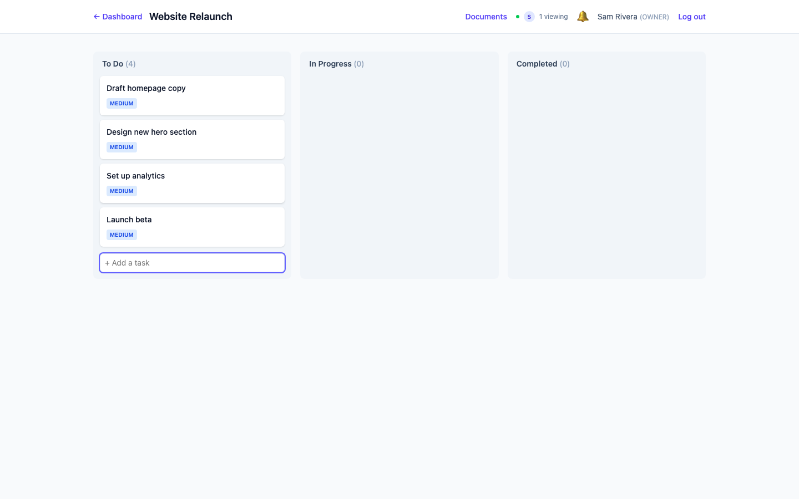
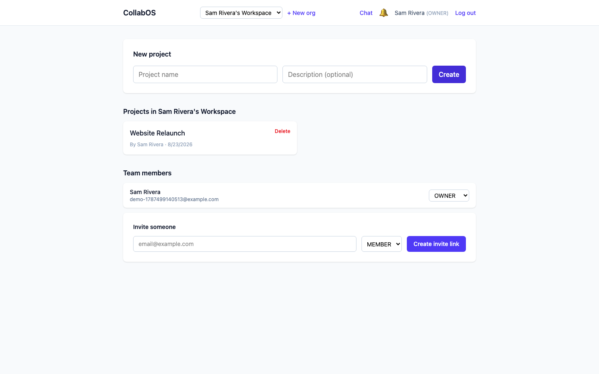
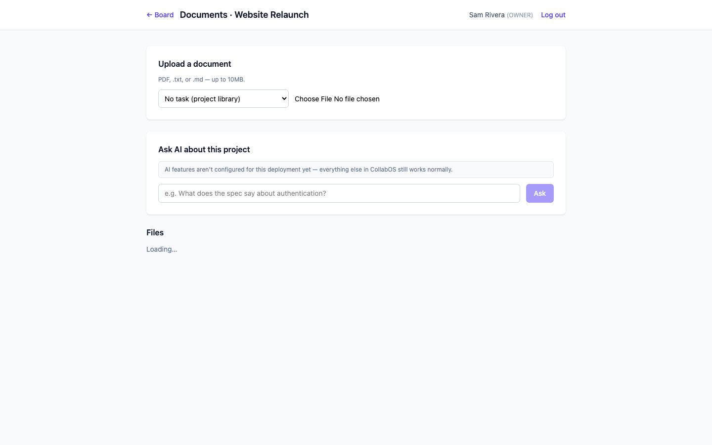
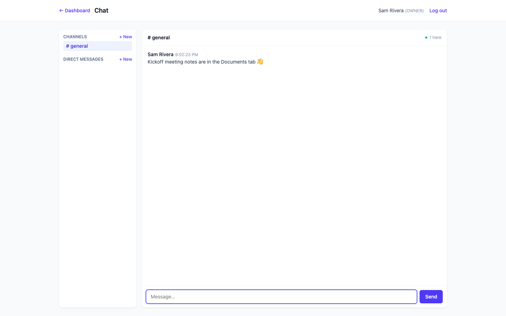

# CollabOS AI

A full-stack enterprise collaboration platform — Jira-style Kanban boards, Slack-style chat, and Notion-ish document management — plus an opt-in AI layer: a RAG document assistant and two LangGraph tool-calling agents.

Built as two layered resume projects in one codebase: a complete SDE-focused platform (Phases 1–9), extended with an AI-engineering layer (Phases 10–13) that never compromises the first. **The entire core platform runs for $0, with zero configuration, forever.** The AI features are a strictly additive, opt-in layer — set your own API key and they light up; leave it unset and everything else keeps working exactly as before.



<details>
<summary>More screenshots</summary>

| | |
|---|---|
|  |  |
| Dashboard — orgs, projects, team | Documents — upload, Ask AI panel |
|  | |
| Chat — channels and DMs | |

</details>

## Features

**Core platform**
- JWT auth with per-organization RBAC (Owner / Admin / Member / Viewer)
- Multi-tenant organizations, invite-by-link membership
- Kanban project boards with drag-and-drop, live multi-user sync over WebSockets, and presence ("N viewing")
- Slack-style chat: public channels, 1:1 DMs, typing indicators, presence
- Document management: PDF/txt/md upload to a project library or a specific task, access-gated by role
- Event-driven in-app notifications (Kafka-backed) for task creation and document uploads
- Redis caching, rate limiting, and N+1 query elimination on hot read paths

**AI layer** (all opt-in — see [Configuring the AI layer](#configuring-the-ai-layer))
- **Document Assistant Agent** — a LangGraph tool-calling agent that searches a project's indexed documents (via `pgvector` similarity search) and answers questions, citing real sources
- **Project Manager Agent** — a LangGraph tool-calling agent that reads a project's live task data (via direct SQL tools) and produces a risk/priority summary
- Document summarization
- Lightweight feedback loop (👍/👎 + optional correction) on every AI answer, plus structured interaction logging in the AI service

See [docs/AI_PIPELINE.md](docs/AI_PIPELINE.md) for how the RAG ingestion and agent tool-calling actually work.

## Tech stack

| Layer | Stack |
|---|---|
| Frontend | React 19, Vite, Tailwind CSS v4, Zustand, TanStack Query, react-router-dom |
| Backend | Spring Boot 4.1 (Java 21), Spring Security, Hibernate/JPA |
| AI service | Python, FastAPI, LangChain, LangGraph, `sentence-transformers` |
| Data | PostgreSQL (+ `pgvector`), Redis, Kafka (KRaft mode, no Zookeeper) |
| Testing | JUnit 5 + Mockito + AssertJ, Vitest + React Testing Library, pytest, Postman |

Architecture details and a request-flow diagram: [docs/ARCHITECTURE.md](docs/ARCHITECTURE.md). Database schema: [docs/SCHEMA.md](docs/SCHEMA.md). API reference: [docs/API.md](docs/API.md).

## Quick start (Docker Compose)

Requires Docker and Docker Compose.

```bash
cp .env.example .env   # optional — everything works with defaults, AI stays "not configured"
docker compose up --build
```

- Frontend: http://localhost:5173
- Backend API: http://localhost:8080/api
- AI service: http://localhost:8000

> **Note:** the `docker-compose.yml` and Dockerfiles in this repo have been written and reviewed but not yet run end-to-end in this environment (Docker wasn't available here). If you hit an issue on first run, it's likely a rough edge worth filing — the local (non-Docker) setup below has been fully exercised.

## Quick start (local, no Docker)

Everything runs as native local processes — no containers, no cloud accounts, nothing that can incur a charge.

**Prerequisites (macOS + Homebrew shown; adjust for your OS):**
```bash
brew install postgresql@14 redis kafka python@3.13
brew services start postgresql@14
brew services start redis
brew services start kafka
```

**Database — pgvector:** if your Postgres build doesn't already bundle `pgvector`, build it from source against your installed version (Homebrew's pgvector bottle only targets newer Postgres majors):
```bash
git clone --branch v0.8.0 --depth 1 https://github.com/pgvector/pgvector.git
cd pgvector
PG_CONFIG=$(brew --prefix postgresql@14)/bin/pg_config make
PG_CONFIG=$(brew --prefix postgresql@14)/bin/pg_config make install
```
```sql
-- as a Postgres superuser
CREATE DATABASE collabos;
CREATE USER collabos WITH PASSWORD 'collabos';
GRANT ALL PRIVILEGES ON DATABASE collabos TO collabos;
\c collabos
CREATE EXTENSION vector;
```

**Kafka topics:**
```bash
kafka-topics --create --topic task-events --bootstrap-server localhost:9092
kafka-topics --create --topic document-events --bootstrap-server localhost:9092
kafka-topics --create --topic document-deleted-events --bootstrap-server localhost:9092
```

**Backend:**
```bash
cd backend
./mvnw spring-boot:run
```

**Frontend:**
```bash
cd frontend
npm install
npm run dev
```

**AI service** (optional — the platform works fully without it; skip if you don't want the AI features):
```bash
cd ai-service
python3 -m venv .venv
source .venv/bin/activate
pip install -r requirements.txt
cp .env.example .env   # add your own LLM key here if you want AI features live
uvicorn app.main:app --reload
```

Visit http://localhost:5173, register an account, and go.

## Configuring the AI layer

The AI layer needs two things, both optional, both configured purely via environment variables — nothing is ever hardcoded:

1. **A hosted LLM**, behind an OpenAI-compatible interface. Tested against [Groq's free tier](https://console.groq.com) (no cost, no credit card). OpenRouter, Together, a local Ollama server, or real OpenAI all work too — just change the base URL/model.
   ```bash
   # ai-service/.env
   LLM_PROVIDER=groq
   LLM_API_KEY=your-key-here
   LLM_BASE_URL=https://api.groq.com/openai/v1
   LLM_MODEL=llama-3.1-8b-instant
   ```
2. **Nothing else** — document embeddings run locally via `sentence-transformers`, so indexing and search work with *zero* API key. Only answer generation (the LLM call itself) needs the key above.

Until `LLM_API_KEY` is set, every AI endpoint responds with `{"configured": false, ...}` and the UI shows an inline "AI features aren't configured" notice — the rest of the app is completely unaffected.

## Testing

```bash
# Backend — JUnit 5 + Mockito + AssertJ
cd backend && ./mvnw test

# ai-service — pytest (DB access is mocked, no live Postgres needed)
cd ai-service && source .venv/bin/activate && pytest

# Frontend — Vitest + React Testing Library
cd frontend && npm test
```

A Postman collection covering the full API is at [`CollabOS.postman_collection.json`](CollabOS.postman_collection.json).

## Project structure

```
backend/       Spring Boot API — auth, orgs, projects, tasks, chat, documents, notifications, AI proxy
frontend/      React SPA
ai-service/    FastAPI — RAG ingestion, LangGraph agents, feedback logging
infra/         Docker Compose init scripts (Postgres pgvector extension)
docs/          Architecture, schema, API reference, AI pipeline explanation, screenshots
```

## Documentation

- [Architecture](docs/ARCHITECTURE.md) — service breakdown, request flow, why each technology choice was made
- [AI pipeline](docs/AI_PIPELINE.md) — RAG ingestion, retrieval, and the two LangGraph agents in detail
- [Database schema](docs/SCHEMA.md)
- [API reference](docs/API.md)
