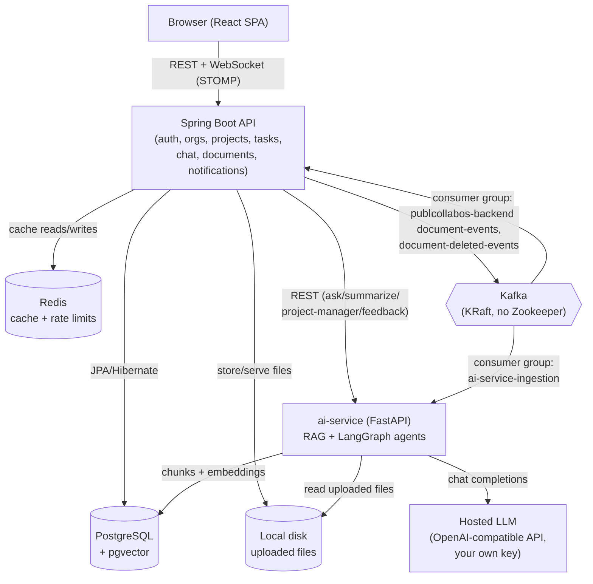

# Architecture

## Services

Two independent Kafka consumer groups read the same `document-events` topic: the backend's own group turns an upload into an in-app notification, and `ai-service`'s group turns it into a RAG-ingestion job (chunk → embed → store in `pgvector`). Neither knows about the other — `DocumentService` publishes one event and both consumers just show up. That's the whole point of putting this behind Kafka instead of a direct method call.

## Why these choices

- **Local disk for files, not S3** — this is a free, local-only project; a real object store is the first thing that could ever cost money. Files are named by a random UUID (never derived from client input), which rules out both path traversal and filename collisions in one move.
- **`pgvector` on the existing Postgres, not a dedicated vector DB** — same reasoning as everywhere else: fewer moving parts, one less service to install and keep alive, and Postgres already has the document metadata this needs to join against.
- **Kafka in KRaft mode, no Zookeeper** — simpler local setup, and it's how new Kafka deployments are meant to run anyway.
- **JWT is identity-only** — the token proves *who* the caller is; it never carries a role. Roles are per-organization and looked up fresh from `memberships` on every request, so a role change takes effect immediately instead of waiting for a token to expire.
- **Local embeddings, hosted LLM only for generation** — `sentence-transformers` runs on the ai-service box for free, so document ingestion and search work with zero external dependency. Only the final "write me an answer" step needs a configured API key, which is exactly the piece that's genuinely worth paying a hosted model for.
- **Explicit hand-rolled Redis caching, not `@Cacheable`** — an earlier `@Cacheable` attempt hit real problems with generic-collection type erasure and Jackson polymorphic-typing mismatches. The explicit `JsonCache` helper (typed `get`/`put`/`evict` calls, wired manually into every mutation) traded a little boilerplate for something predictable and easy to reason about — deliberately never used to cache authorization checks, only read-model data.

## Request flow: asking the Document Assistant a question

1. Browser calls `POST /api/organizations/{orgId}/projects/{projectId}/ai/ask` with a JWT.
2. Spring Boot's `AiController` verifies the caller is a member of that org/project (any role, including Viewer — asking is read-only), then proxies the request to `ai-service` over plain HTTP.
3. `ai-service` builds a LangGraph `create_react_agent` bound to one tool, `search_documents`, and hands it the question.
4. The agent decides whether to call the tool. If it does, `search_documents` embeds the query locally, runs a `pgvector` cosine-similarity search scoped to that project, and returns the matching chunks labeled by source file name.
5. The agent's final answer, plus the source file names extracted from its actual tool calls (not a second query), goes back through Spring Boot to the browser.
6. If no `LLM_API_KEY` is configured anywhere in this chain, step 3 never happens — `ai-service` returns `{"configured": false}` immediately, and the UI shows an inline notice instead of an error.

## Auth & authorization

- Passwords: BCrypt.
- Tokens: JWT (HS512), identity claims only (`sub`, `email`, `name`), 24h expiry.
- Every mutating endpoint re-derives the caller's role from `memberships` — nothing sensitive is trusted from the token beyond "who is this."
- WebSocket auth is a special case: the JWT travels inside the STOMP `CONNECT` frame (not a header, since raw WebSocket handshakes don't carry custom headers reliably), verified by a `ChannelInterceptor` before the session is allowed to subscribe to anything.
