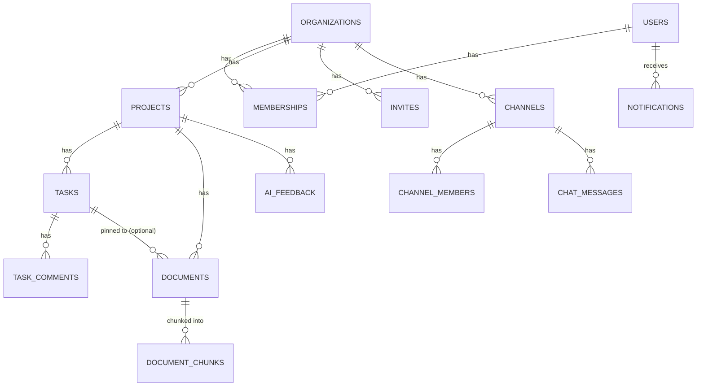

# Database schema

PostgreSQL, managed by Hibernate (`spring.jpa.hibernate.ddl-auto=update`) for every table except `document_chunks`, which `ai-service` creates and owns directly via raw SQL (it's the one table nothing in the JPA entity graph touches).

## Core relationships

## Tables

**`users`** — `id`, `name`, `email` (unique), `password_hash` (BCrypt), `created_at`.

**`organizations`** — `id`, `name`, `slug`, `created_at`. The multi-tenancy boundary — almost every other table hangs off an org either directly or via project/channel.

**`memberships`** — `id`, `organization_id`, `user_id`, `role` (`OWNER`/`ADMIN`/`MEMBER`/`VIEWER`), `joined_at`. The single source of truth for authorization; re-checked on every request rather than trusted from the JWT.

**`invites`** — `id`, `organization_id`, `email`, `role`, `token`, `status`, `expires_at`, `invited_by`, `created_at`. Token-based, email-matched, idempotent accept.

**`projects`** — `id`, `organization_id`, `owner_id`, `name`, `description`, `created_at`.

**`tasks`** — `id`, `project_id`, `title`, `description`, `status` (`TODO`/`IN_PROGRESS`/`DONE`), `priority` (`LOW`/`MEDIUM`/`HIGH`/`URGENT`), `assignee_id`, `created_by`, `due_date`, `position` (drag-and-drop ordering within a column), `created_at`, `updated_at`.

**`task_comments`** — `id`, `task_id`, `author_id`, `body`, `created_at`.

**`documents`** — `id`, `project_id`, `task_id` (nullable — project-library doc vs. task-pinned doc), `uploaded_by`, `original_file_name`, `stored_file_name` (a random UUID + extension — never derived from client input), `content_type`, `file_size_bytes`, `created_at`. The actual file lives on local disk under `backend/uploads/`, named by `stored_file_name`.

**`document_chunks`** *(owned by `ai-service`, not Hibernate)* — `id`, `document_id`, `organization_id`, `project_id`, `chunk_index`, `content` (text), `embedding` (`vector(384)`, via `pgvector`), `created_at`. One row per chunk produced during ingestion; deleted and re-inserted on re-ingestion, deleted entirely when the source document is deleted.

**`channels`** — `id`, `organization_id`, `name` (null for DMs), `type` (`PUBLIC`/`DIRECT`), `created_by`, `created_at`.

**`channel_members`** — `id`, `channel_id`, `user_id`, `joined_at`.

**`chat_messages`** — `id`, `channel_id`, `author_id`, `body`, `created_at`.

**`notifications`** — `id`, `organization_id`, `recipient_id`, `type` (`TASK_CREATED`/`DOCUMENT_UPLOADED`), `message`, `link`, `read`, `created_at`. Populated by a Kafka consumer reacting to `task-events`/`document-events`, not written synchronously by the action that triggered them.

**`ai_feedback`** — `id`, `organization_id`, `project_id`, `user_id`, `agent_type` (`DOCUMENT_ASSISTANT`/`PROJECT_MANAGER`), `question` (nullable — the Project Manager Agent isn't answering a specific question), `answer`, `rating` (`UP`/`DOWN`), `correction` (nullable free text), `created_at`.

## Indexes worth knowing about

- `memberships(organization_id, user_id)` — the hot path for every authorization check.
- `tasks(project_id)`, `documents(project_id)`, `notifications(recipient_id)`, `ai_feedback(project_id)` — the obvious per-parent list queries.
- `document_chunks` has an HNSW index on `embedding` (`vector_cosine_ops`) for fast similarity search, plus a plain btree on `project_id` to scope searches before the vector comparison even runs.
